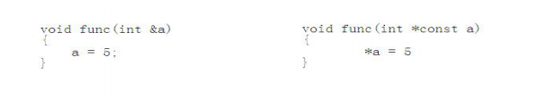

# C++基础

## 1.C++对C的加强
### 1)register 关键字增强
c语言中寄存器变量是不能取地址的
### 2)const在c++中实现原理

## 2.引用
**变量名**实质上是一段连续存储空间的别名，是一个标号(门牌号),程序中通过变量来申请并命名内存空间,通过变量的名字可以使用存储空间
> 对一段连续的内存空间取另一个别名——引用
### 1)引用的本质
#### (1）引用在C++中的内部实现是一个常指针
```Type& name <---> Type* const name)```

#### (2)引用会让人误会其只是一个别名，没有自己的存储空间。这是C++为了实用性而做出的细节隐藏
C++编译器在编译过程中使用常指针作为引用的内部实现，因此引用所占用的空间大小与指针相同。
###### C++编译器内部进行变换了



